# MisOr Transit — Bus Seat Reservation & Booking System

A real-time bus seat reservation and booking system for the **Tagoloan ↔ Cagayan de Oro** route in Misamis Oriental, Philippines. Passengers can reserve seats online, pay via GCash / Maya / Card or pay cash on board. Staff manage their bus live from a dedicated panel.

---

## Features

- **Live bus tracking** — real-time seat availability across 5 buses on the route
- **Route-aware booking** — only shows stops the bus hasn't passed yet
- **Fair pricing** — verified students, seniors, and PWDs get discounted fares
- **Two payment options** — pay online (instant QR ticket) or pay cash on board (downloadable PDF ticket)
- **Staff panel** — passcode-protected bus management, live seat map, e-cash & cash passenger lists
- **Discount protection** — one active discounted booking per verified user at a time
- **Auto seat release** — held seats auto-cancel if user closes without paying

---

## Screenshots

### 1. Dashboard — Live Bus Map & Fleet

Browse active buses on the live map. See available seats, current stop, and direction at a glance.

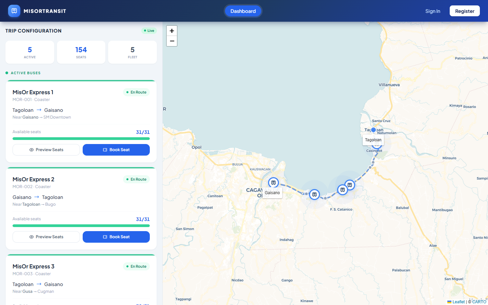

---

### 2. Step 1 — Route Selection

Pick your boarding and drop-off stop. Fare is calculated instantly based on distance and passenger type.

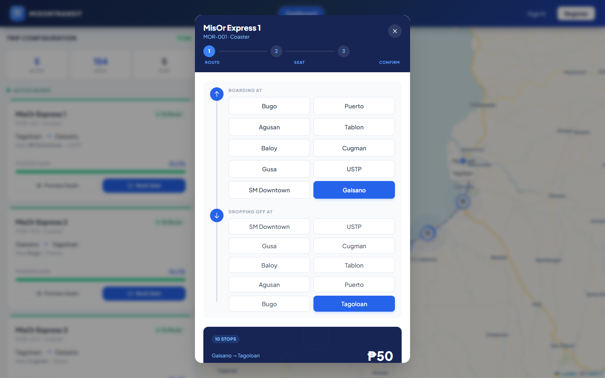

---

### 3. Step 2 — Seat Selection

Visual seat map of the bus interior. Available seats are gray, held seats are amber, booked seats are blue.

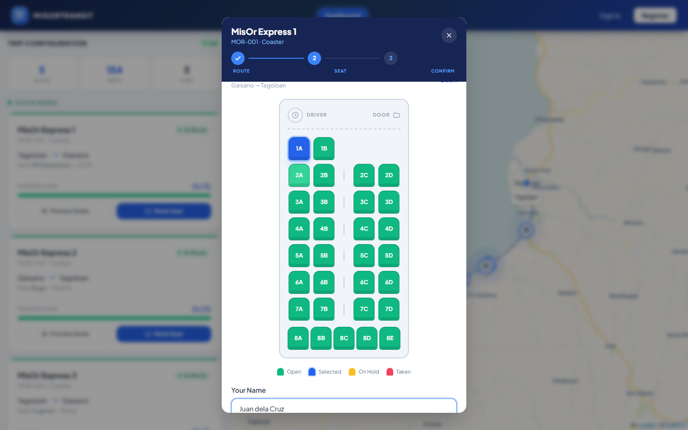

---

### 4. Step 3 — Payment Choice

After holding a seat, choose how to pay: **Pay Online** (instant confirmation) or **Pay on Board** (reserve now, pay cash when boarding).

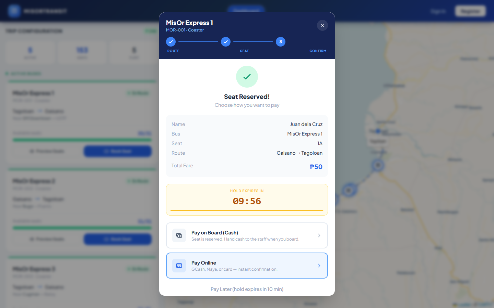

---

### 5. Online Payment — GCash / Maya / Card

Select your e-wallet or card. A 2-second processing animation confirms the payment instantly — no external redirect.

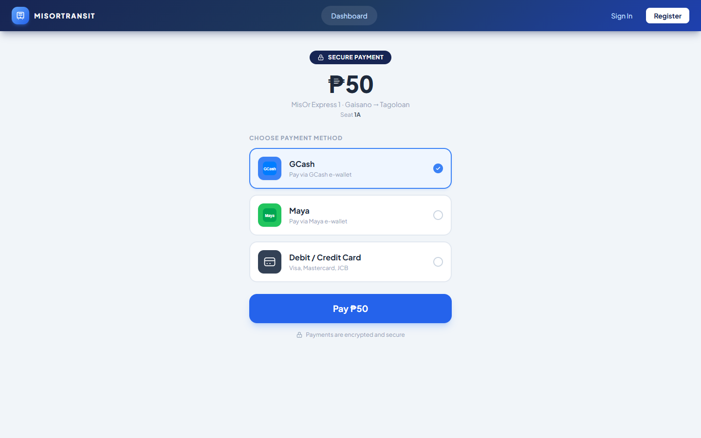

---

### 6. Payment Processing

Simulated payment processing with animated spinner.

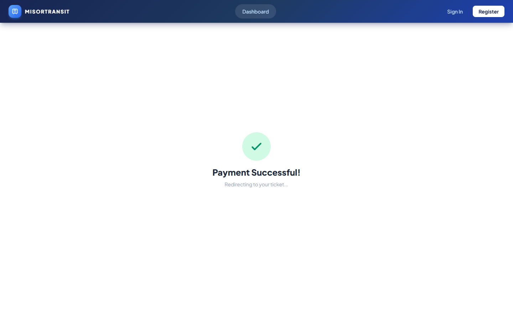

---

### 7. Confirmed Ticket — Online Payment

Online-paid bookings get a **QR code ticket** for boarding verification.

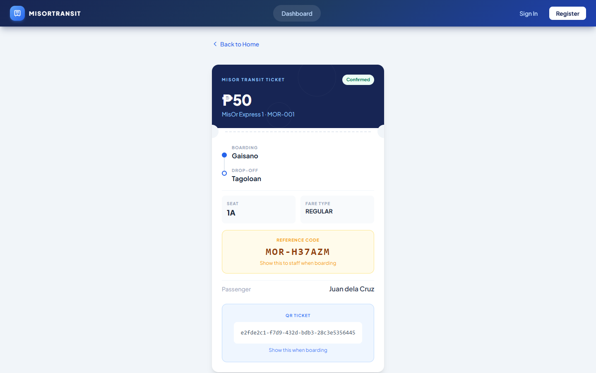

---

### 8. Confirmed Ticket — Cash on Board

Cash bookings get a **Pay on Board** ticket with a reference code. Downloadable as PDF. Staff will call your reference code when boarding.

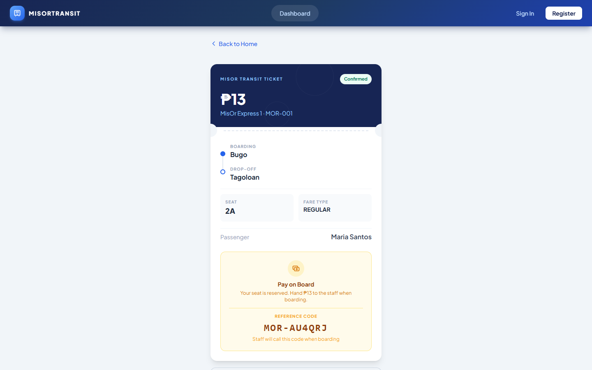

---

### 9. Login Page

Secure login for registered passengers, staff, and admin.

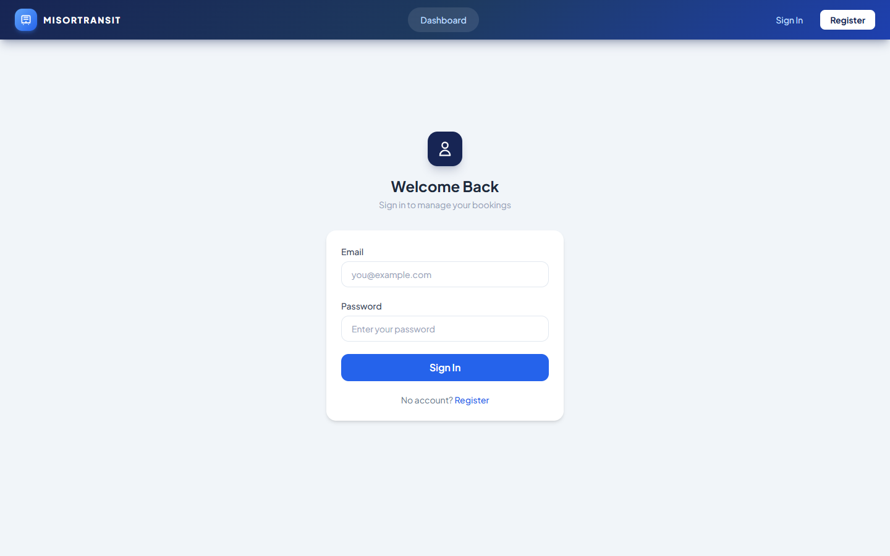

---

### 10. Staff Panel — Bus Selection

Staff enter their assigned bus passcode to unlock controls.

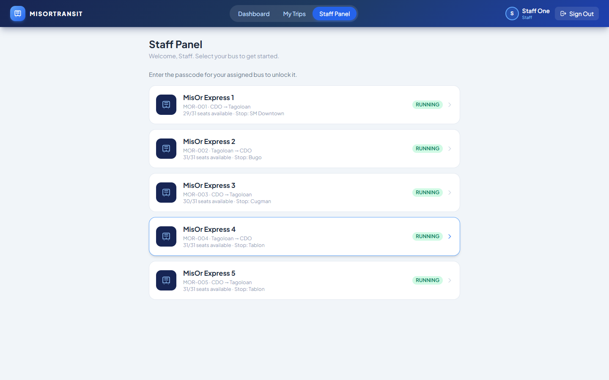

---

### 11. Staff Panel — Bus Passcode

Passcode-protected access ensures only assigned staff can control a bus.

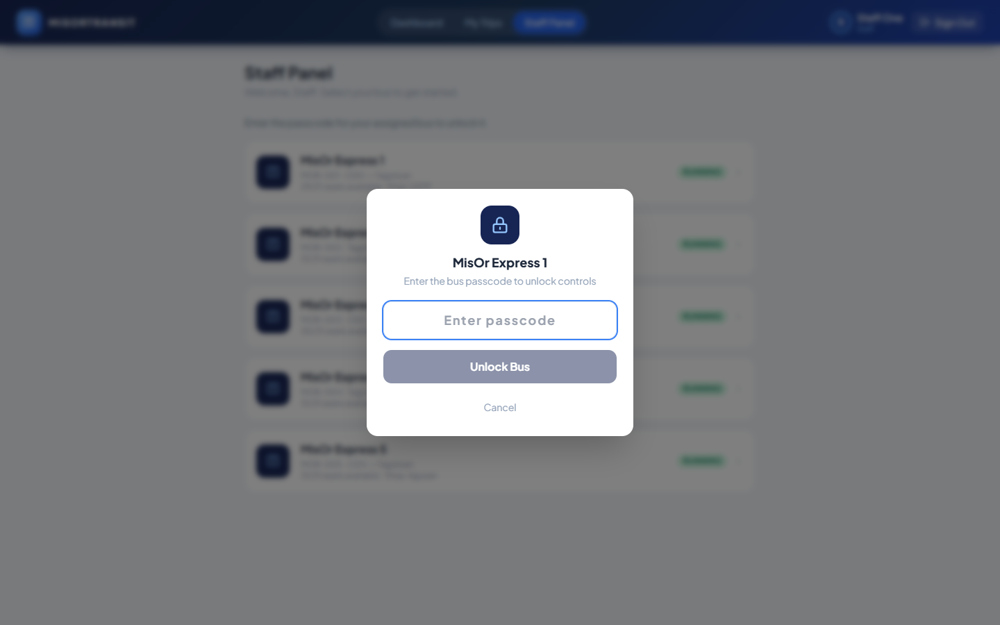

---

### 12. Staff Panel — Active Bus Controls

Manage bus status (Running / Paused / Parked), advance stops, and adjust simulation speed. View e-cash and cash passenger lists in real time.

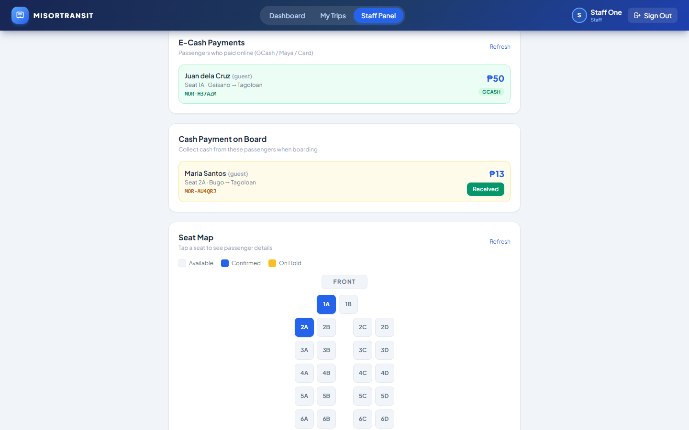

---

### 13. Staff Panel — Live Seat Map

Color-coded seat grid. Click any booked seat to see passenger name, route, fare, and payment status (Paid Online or Cash on Board).

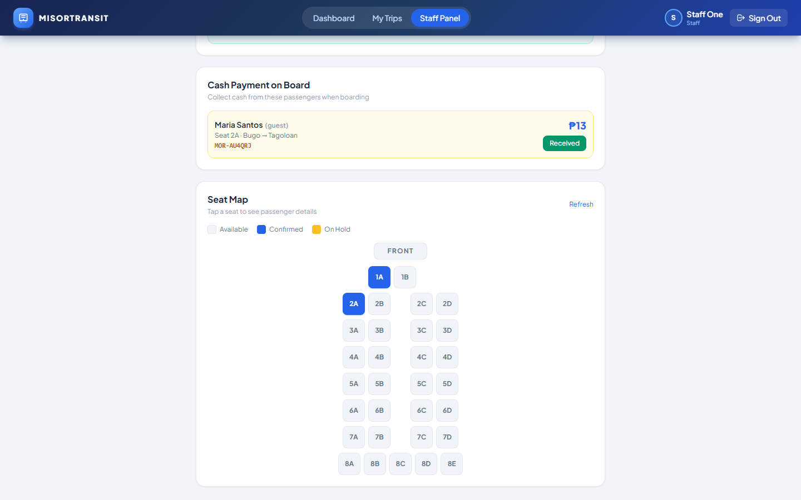

---

## Tech Stack

| Layer | Tech |
|-------|------|
| Framework | Next.js 14 (App Router) |
| Database | PostgreSQL + Prisma ORM |
| Auth | JWT (custom) |
| State | Zustand |
| Map | Leaflet (react-leaflet) |
| Styling | Tailwind CSS |
| PDF Export | html2canvas + jsPDF |

---

## Accounts (Development / Seed)

| Role | Email | Password |
|------|-------|----------|
| Admin | `admin@misortransit.com` | `admin123` |
| Staff 1 | `staff1@misortransit.com` | `staff1234` |
| Staff 2 | `staff2@misortransit.com` | `staff1234` |
| Passenger | `demo@passenger.com` | `user123` |

**Bus Passcodes:** `bus001` through `bus005` (matching each bus number)

---

## Local Setup

```bash
# 1. Install dependencies
npm install

# 2. Configure environment
# Create .env with:
# DATABASE_URL="postgresql://..."
# JWT_SECRET="your-secret"

# 3. Push schema and seed data
npx prisma db push
npx prisma db seed

# 4. Start dev server
npm run dev
```

Open [http://localhost:3000](http://localhost:3000)

---

## Deployment (Free)

**Database:** [Railway](https://railway.app) — free PostgreSQL  
**App:** [Vercel](https://vercel.com) — free Next.js hosting

Steps:
1. Push code to GitHub
2. Create a PostgreSQL database on Railway → copy the `DATABASE_URL`
3. Import the GitHub repo on Vercel
4. Add environment variables on Vercel: `DATABASE_URL`, `JWT_SECRET`
5. Add build command: `npx prisma generate && npx prisma db push && next build`
6. Deploy — Vercel auto-deploys on every push
